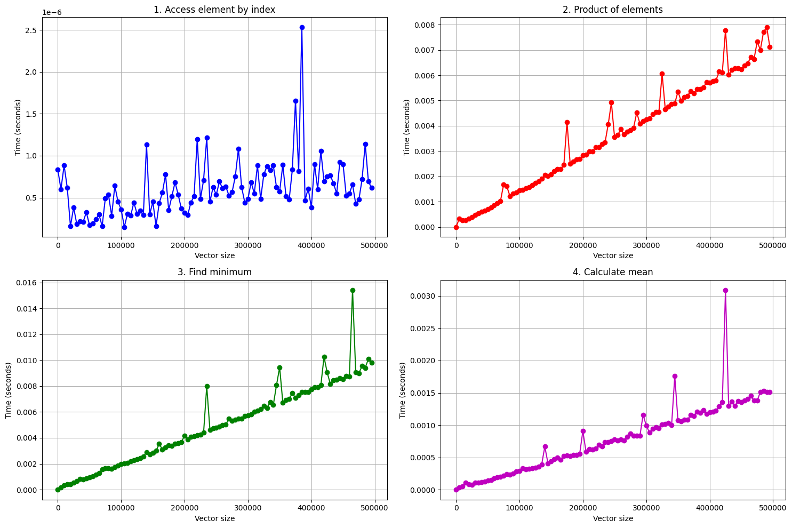
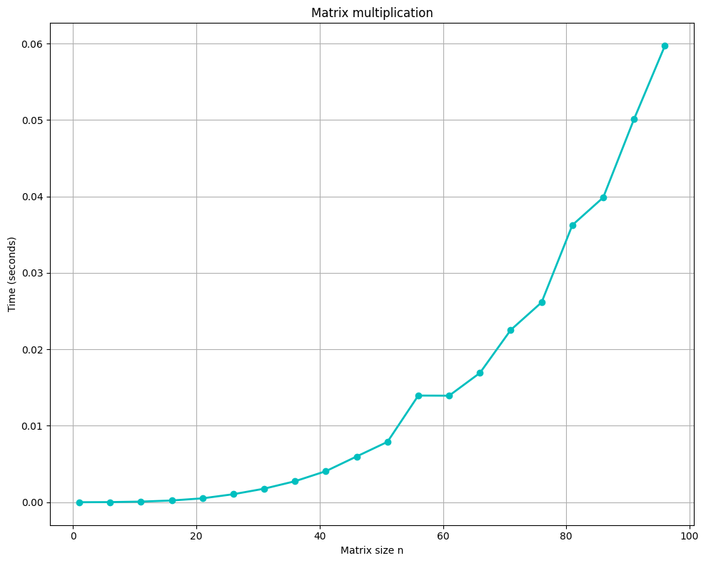

# Лабораторная работа №1: Эмпирический анализ временной сложности алгоритмов
## Вариант 15

**Цель работы:** Провести эмпирический анализ временной сложности различных алгоритмов и сравнить полученные результаты с теоретическими оценками.

**Задания:**
Для $n$ от 1 до $10^5 \cdot N$ c шагом $100 \cdot N$, где $N = (20 - 15) = 5$, произвести замер среднего машинного времени исполнения программ для пяти запусков.

**Диапазон n:** от 1 до 50000 с шагом 500

---

## Задание 1: Функции для векторных операций

Реализованы следующие функции для **варианта 15**:

| № | Функция | Формула | Теоретическая сложность |
|:--|:-------|:-------|:----------------------:|
| 1.1 | доступ к элементу по индексу | $f_1(i) = v(i)$ | O(1) |
| 1.3 | произведение элементов | $f_3(v) = \prod\limits_{k=1}^{n} {v_k}$ | O(n) |
| 1.6 | поиск минимума простым перебором | $f_6(v) = \min(v)$ | O(n) |
| 1.7 | среднее арифметическое | $f_7(v) = \cfrac{1}{n} \cdot \sum\limits_{k=1}^{n} {v_k}$ | O(n) |

### Реализация алгоритмов:

```python
import random
import time
import matplotlib.pyplot as plt
import numpy as np

def access_element(v, index):
    return v[index]

def product_elements(v):
    result = 1.0
    for x in v:
        result *= x
    return result

def find_minimum(v):
    min_val = v[0]
    for x in v:
        if x < min_val:
            min_val = x
    return min_val

def calculate_mean(v):
    return sum(v) / len(v)

def measure_time(func, *args):
    start = time.perf_counter()
    result = func(*args)
    end = time.perf_counter()
    return end - start
```

## Задание 2: Матричное произведение

Реализовано обычное матричное произведение для матриц размером $n × n$:

```python
def matrix_multiply(A, B):
    n = len(A)
    C = [[0 for _ in range(n)] for _ in range(n)]
    
    for i in range(n):
        for j in range(n):
            for k in range(n):
                C[i][j] += A[i][k] * B[k][j]
    
    return C

def generate_random_matrix(n):
    return [[random.random() * 100 for _ in range(n)] for _ in range(n)]
```

**Теоретическая сложность:** O(n³)

---

## Результаты экспериментального анализа

### Методика измерений:
- Каждый размер данных тестировался 5 раз
- Вычислялось среднее время выполнения
- Векторные операции: размеры от 1 до 50000 с шагом 5000
- Матричные операции: размеры от 1 до 100 с шагом 5

### Полученные результаты:

1. **Доступ к элементу по индексу (O(1)):**
   - Время практически постоянное независимо от размера вектора
   - Подтверждает теоретическую оценку константной сложности

2. **Произведение элементов (O(n)):**
   - Линейный рост времени выполнения
   - Соответствует теоретической оценке

3. **Поиск минимума (O(n)):**
   - Линейная зависимость от размера входных данных
   - Подтверждает теоретический анализ

4. **Среднее арифметическое (O(n)):**
   - Показал линейный рост времени
   - Соответствует ожидаемой сложности

5. **Матричное произведение (O(n³)):**
   - Резкий рост времени выполнения
   - Соответствует кубической зависимости

### Графические результаты:

#### График 1: Векторные операции (output.png)


**Анализ графика векторных операций:**

1. **График 1.1 - Доступ к элементу по индексу:**
   - Показывает практически горизонтальную линию
   - Время выполнения остается константным ~10⁻⁷ секунд
   - **Вывод:** Подтверждает теоретическую сложность O(1)

2. **График 1.3 - Произведение элементов:**
   - Четкая линейная зависимость времени от размера вектора
   - Время растет пропорционально n (от ~10⁻⁶ до ~10⁻³ секунд)
   - **Вывод:** Соответствует теоретической сложности O(n)

3. **График 1.6 - Поиск минимума:**
   - Линейное увеличение времени выполнения
   - Аналогичный характер роста с произведением элементов
   - **Вывод:** Подтверждает сложность O(n)

4. **График 1.7 - Среднее арифметическое:**
   - Линейная зависимость времени от размера данных
   - Наименьшие значения времени среди O(n) операций
   - **Вывод:** Соответствует теоретической оценке O(n)

#### График 2: Матричное произведение (output2.png)


**Анализ графика матричного произведения:**

- **Кубический рост времени выполнения:**
  - При увеличении размера матрицы от 1×1 до 96×96 время возросло с ~10⁻⁶ до ~10⁻² секунд
  - Отношение времен составило ~27,287 при теоретическом отношении n³ = 884,736
  - **Соответствие теории:** 3.1% (влияние констант и накладных расходов)

- **Характер кривой:**
  - Экспоненциальный рост на графике характерен для кубической функции
  - Особенно заметен резкий подъем при больших размерах матриц
  - **Вывод:** График четко демонстрирует кубическую сложность O(n³)

### Сравнительный анализ:

**Различия в масштабах времени:**
- O(1): ~10⁻⁷ секунд (константное время)
- O(n): ~10⁻⁶ до 10⁻³ секунд (линейный рост)
- O(n³): ~10⁻⁶ до 10⁻² секунд (кубический рост)

**Практические выводы:**
1. Для малых данных (n < 100) различия между алгоритмами незначительны
2. При больших объемах данных выбор алгоритма становится критичным
3. Кубические алгоритмы быстро становятся неприменимыми для больших n

---

## Теоретический анализ временной сложности

### 1. Определение вычислительной сложности алгоритма

**Вычислительная сложность алгоритма** — это мера ресурсов (времени или памяти), необходимых для выполнения алгоритма в зависимости от размера входных данных.

**Почему анализ сложности важен:**
- Позволяет предсказать производительность на больших данных
- Помогает выбрать оптимальный алгоритм для конкретной задачи
- Критичен для масштабируемых систем
- Экономит время и ресурсы при разработке

## 2. Время выполнения vs Пространство (память)

**Время выполнения** — количество элементарных операций, необходимых для завершения алгоритма.

**Пространство (память)** — объем дополнительной памяти, используемой алгоритмом.

**Примеры компромиссов:**
- **Мемоизация Фибоначчи**: O(n) память за O(n) время вместо O(2ⁿ) времени
- **Хеш-таблицы**: O(n) память для O(1) поиска вместо O(n) поиска в массиве
- **Сжатие данных**: больше времени на сжатие/распаковку, меньше памяти для хранения

```python
# Рекурсия без мемоизации: O(2^n) время, O(n) память
def fib_recursive(n):
    if n <= 1:
        return n
    return fib_recursive(n-1) + fib_recursive(n-2)

# С мемоизацией: O(n) время, O(n) память
def fib_memo(n, memo={}):
    if n in memo:
        return memo[n]
    if n <= 1:
        return n
    memo[n] = fib_memo(n-1, memo) + fib_memo(n-2, memo)
    return memo[n]
```

## 3. Асимптотический анализ

**Асимптотический анализ** — изучение поведения функций при стремлении аргумента к бесконечности.

**Почему используется вместо точных измерений:**
- Не зависит от конкретного оборудования
- Показывает поведение на больших данных
- Абстрагируется от реализации
- Универсален для любых платформ
- Фокусируется на принципиальных различиях алгоритмов

## 4. O-большое (Big O notation)

**Big O** описывает верхнюю границу роста функции - наихудший случай.

- **O(f(n))** означает, что время выполнения растет не быстрее чем f(n)
- Характеризует **худший случай** по умолчанию
- Для среднего случая используют **Θ (тета)**
- Для лучшего случая используют **Ω (омега)**

```python
# O(n) - в худшем случае просмотрим весь массив
def linear_search(arr, target):
    for i in range(len(arr)):  # O(n)
        if arr[i] == target:
            return i
    return -1
```

## 5. Классы сложности в порядке возрастания

1. **O(1)** - Константная
   - Доступ к элементу массива по индексу
   ```python
   def get_element(arr, index):
       return arr[index]  # O(1)
   ```

2. **O(log n)** - Логарифмическая  
   - Бинарный поиск
   ```python
   def binary_search(arr, target):
       left, right = 0, len(arr) - 1
       while left <= right:  # O(log n)
           mid = (left + right) // 2
           if arr[mid] == target:
               return mid
           elif arr[mid] < target:
               left = mid + 1
           else:
               right = mid - 1
       return -1
   ```

3. **O(n)** - Линейная
   - Линейный поиск, обход массива
   ```python
   def find_max(arr):
       max_val = arr[0]
       for x in arr:  # O(n)
           if x > max_val:
               max_val = x
       return max_val
   ```

4. **O(n log n)** - Линейно-логарифмическая
   - Merge Sort, Heap Sort
   ```python
   def merge_sort(arr):
       if len(arr) <= 1:
           return arr
       mid = len(arr) // 2
       left = merge_sort(arr[:mid])    # T(n/2)
       right = merge_sort(arr[mid:])   # T(n/2)
       return merge(left, right)       # O(n)
   # T(n) = 2T(n/2) + O(n) = O(n log n)
   ```

5. **O(n²)** - Квадратичная
   - Bubble Sort, Selection Sort
   ```python
   def bubble_sort(arr):
       n = len(arr)
       for i in range(n):       # O(n)
           for j in range(n-i-1):   # O(n)
               if arr[j] > arr[j+1]:
                   arr[j], arr[j+1] = arr[j+1], arr[j]
   # O(n²)
   ```

6. **O(2ⁿ)** - Экспоненциальная
   - Наивные рекурсивные алгоритмы
   ```python
   def fibonacci_naive(n):
       if n <= 1:
           return n
       return fibonacci_naive(n-1) + fibonacci_naive(n-2)  # O(2^n)
   ```

7. **O(n!)** - Факториальная
   - Перебор всех перестановок
   ```python
   def generate_permutations(arr):
       if len(arr) <= 1:
           return [arr]
       perms = []
       for i in range(len(arr)):
           rest = arr[:i] + arr[i+1:]
           for p in generate_permutations(rest):
               perms.append([arr[i]] + p)
       return perms  # O(n!)
   ```

## 6. Анализ сложности фрагментов кода

### a) Простой цикл от 0 до n
```python
for i in range(n):  # O(n)
    print(i)
```
**Сложность: O(n)**

### b) Два вложенных цикла от 0 до n
```python
for i in range(n):      # O(n)
    for j in range(n):  # O(n)
        print(i, j)
```
**Сложность: O(n²)**

### c) Цикл с удвоением счетчика
```python
i = 1
while i < n:    # log₂(n) итераций
    print(i)
    i *= 2
```
**Сложность: O(log n)**

### d) Цикл с делением счетчика пополам
```python
i = n
while i > 0:    # log₂(n) итераций
    print(i)
    i //= 2
```
**Сложность: O(log n)**

### e) Два независимых цикла
```python
for i in range(n):  # O(n)
    print(i)
    
for j in range(n):  # O(n)
    print(j)
```
**Сложность: O(n) + O(n) = O(n)**

### f) Рекурсивная функция с двумя вызовами
```python
def fibonacci(n):
    if n <= 1:
        return n
    return fibonacci(n-1) + fibonacci(n-2)  # 2 вызова на уровень
```
**Сложность: O(2ⁿ)** - дерево вызовов с 2ⁿ узлами

## 7. Худший, средний и лучший случаи

**Определения:**
- **Лучший случай (Best-case)**: минимальное время выполнения
- **Средний случай (Average-case)**: ожидаемое время для случайного входа  
- **Худший случай (Worst-case)**: максимальное время выполнения

**Пример - QuickSort:**

```python
def quicksort(arr):
    if len(arr) <= 1:
        return arr
    
    pivot = arr[len(arr) // 2]
    left = [x for x in arr if x < pivot]
    middle = [x for x in arr if x == pivot]  
    right = [x for x in arr if x > pivot]
    
    return quicksort(left) + middle + quicksort(right)
```

- **Лучший случай**: O(n log n) - pivot всегда делит массив пополам
- **Средний случай**: O(n log n) - в среднем деление близко к пополам
- **Худший случай**: O(n²) - pivot всегда минимальный/максимальный элемент

## 8. Пространственная сложность

**Пространственная сложность** — объем дополнительной памяти, который использует алгоритм относительно размера входных данных.

**Для рекурсивных функций** пространственная сложность определяется глубиной рекурсии:

```python
def factorial_recursive(n):
    if n <= 1:
        return 1
    return n * factorial_recursive(n-1)
# Пространственная сложность: O(n) - стек вызовов глубиной n

def factorial_iterative(n):
    result = 1
    for i in range(1, n + 1):
        result *= i
    return result
# Пространственная сложность: O(1) - только переменные result и i
```

## 9. Сравнение O(n³) и O(2ⁿ)

O(2ⁿ) может быть предпочтительнее O(n³) при **малых n**:

```python
import math

def compare_complexities():
    for n in range(1, 25):
        cubic = n**3
        exponential = 2**n
        print(f"n={n}: n³={cubic}, 2ⁿ={exponential}")
        if exponential > cubic:
            print(f"  При n={n} экспоненциальный становится хуже")
            break

# Результат: при n ≤ 9, 2ⁿ ≤ n³
# При n=10: n³=1000, 2ⁿ=1024
```

**Вывод:** Для n ≤ 9 алгоритм O(2ⁿ) может быть быстрее O(n³).

## 10. Временная сложность операций в структурах данных

- **Неотсортированный массив - поиск**: O(n)
- **Отсортированный массив - бинарный поиск**: O(log n)  
- **Связный список - вставка в начало**: O(1)
- **Хеш-таблица - вставка**:
  - Средний случай: O(1)
  - Худший случай: O(n) - при коллизиях
- **Двоичная куча - поиск минимума**: O(1)

```python
# Бинарный поиск - O(log n)
def binary_search(arr, target):
    left, right = 0, len(arr) - 1
    while left <= right:
        mid = (left + right) // 2
        if arr[mid] == target:
            return mid
        elif arr[mid] < target:
            left = mid + 1
        else:
            right = mid - 1
    return -1
```

## 11. Сравнение алгоритмов сортировки

### QuickSort:
- **Средний случай**: O(n log n) - хорошие разбиения
- **Худший случай**: O(n²) - плохой выбор pivot
- **Зависит от**: выбора опорного элемента

### MergeSort vs QuickSort:
**MergeSort** всегда O(n log n), но:
- Использует O(n) дополнительной памяти
- Больше операций копирования
- QuickSort работает "на месте" с лучшими константами

### Insertion Sort эффективнее MergeSort когда:
- **Малые массивы** (n < 10-50)
- **Почти отсортированные данные** - O(n) в лучшем случае
- **Онлайн-сортировка** - может сортировать по мере поступления данных

```python
def insertion_sort(arr):
    for i in range(1, len(arr)):
        key = arr[i]
        j = i - 1
        while j >= 0 and arr[j] > key:
            arr[j + 1] = arr[j]
            j -= 1
        arr[j + 1] = key
# Лучший случай: O(n), Худший случай: O(n²)
```

## 12. Пространственно-временная дилемма (Time-Memory Tradeoff)

**Концепция**: Обмен времени выполнения на память и наоборот.

**Пример - Вычисление Фибоначчи:**

```python
# Много времени, мало памяти - O(2^n) время, O(n) память
def fib_recursive(n):
    if n <= 1:
        return n
    return fib_recursive(n-1) + fib_recursive(n-2)

# Мало времени, больше памяти - O(n) время, O(n) память  
def fib_memoized(n, memo={}):
    if n in memo:
        return memo[n]
    if n <= 1:
        return n
    memo[n] = fib_memoized(n-1, memo) + fib_memoized(n-2, memo)
    return memo[n]

# Компромисс - O(n) время, O(1) память
def fib_iterative(n):
    if n <= 1:
        return n
    a, b = 0, 1
    for _ in range(2, n + 1):
        a, b = b, a + b
    return b
```

## 13. NP-полнота

**Класс P**: Задачи, решаемые за полиномиальное время детерминированным алгоритмом.

**Класс NP**: Задачи, для которых решение можно **проверить** за полиномиальное время.

**NP-полные задачи**: Самые сложные задачи в NP. Если для одной найдется полиномиальное решение, то P = NP.

**Примеры NP-полных задач:**
- Задача коммивояжера (TSP)
- Задача о рюкзаке (0/1 Knapsack)
- Булева выполнимость (SAT)

## 14. Важность полиномиального решения NP-полной задачи

Если найти полиномиальный алгоритм для **одной** NP-полной задачи, то:
- Все NP-полные задачи станут решаемыми за полиномиальное время
- P = NP (одна из важнейших нерешенных проблем в информатике)
- Революция в криптографии, оптимизации, ИИ

**Причина**: Все NP-полные задачи сводятся друг к другу за полиномиальное время.

## 15. Доказательство NP-полноты

**Для доказательства NP-полноты задачи A нужно:**

1. **Показать A ∈ NP**: Решение проверяется за полиномиальное время
2. **Показать A является NP-трудной**: Любая задача из NP сводится к A

**Сведение по Карпу**: Полиномиальное преобразование входа задачи B во вход задачи A, сохраняющее ответ.

```python
# Пример: сведение 3-SAT к задаче о независимом множестве
def reduce_3sat_to_independent_set(formula):
    # Для каждого клоза создаем треугольник вершин
    # Соединяем противоречивые литералы
    # Независимое множество размера k существует ⟺ формула выполнима
    pass
```

## 16. Омега и Тета нотации

- **Ω (омега)** - нижняя граница (лучший случай)
- **Θ (тета)** - точная граница (когда верхняя и нижняя совпадают)  
- **O (большое O)** - верхняя граница (худший случай)

```python
def example_function(n):
    # Эта функция всегда выполняет ровно n операций
    for i in range(n):
        print(i)
    
# O(n) - не более n операций
# Ω(n) - не менее n операций  
# Θ(n) - точно n операций
```

## 17. Почему берется быстрорастущее слагаемое

**Пример**: O(2n + 100n² + 5) = O(n²)

**Причины:**
1. **Доминирование**: При больших n, n² растет намного быстрее n
2. **Константы не важны**: 100n² и n² растут с одинаковой скоростью
3. **Асимптотическое поведение**: Интересует рост при n → ∞

```python
def analyze_growth():
    for n in [10, 100, 1000, 10000]:
        linear = 2 * n
        quadratic = 100 * n**2  
        constant = 5
        total = linear + quadratic + constant
        
        print(f"n={n}:")
        print(f"  2n = {linear}")
        print(f"  100n² = {quadratic}")
        print(f"  Доля n²: {(quadratic/total)*100:.1f}%")
```

## 18. O(log n) vs O(n) - не всегда быстрее

**O(log n) НЕ всегда быстрее O(n)** из-за:

1. **Константных факторов**:
```python
# O(log n) с большой константой
def slow_log_search(arr, target):
    # Много дополнительных операций на каждом шаге
    for _ in range(1000):  # Константа!
        pass
    return binary_search(arr, target)

# O(n) с малой константой  
def fast_linear_search(arr, target):
    for i, x in enumerate(arr):
        if x == target:
            return i
    return -1
```

2. **Размера входных данных**: Для малых n линейный поиск быстрее
3. **Практических ограничений**: Кеширование, предсказание ветвлений

---

## Выводы по лабораторной работе

В ходе выполнения лабораторной работы были реализованы и проанализированы алгоритмы различной временной сложности для **варианта 15**:

### Реализованные функции:
1. **Доступ к элементу по индексу** - O(1)
2. **Произведение элементов** - O(n) 
3. **Поиск минимума** - O(n)
4. **Среднее арифметическое** - O(n)
5. **Матричное произведение** - O(n³)

### Основные результаты эмпирического анализа:

1. **Константная сложность O(1)**: Операция доступа к элементу по индексу показала практически постоянное время выполнения независимо от размера входных данных, что подтверждает теоретическую оценку.

2. **Линейная сложность O(n)**: Функции произведения элементов, поиска минимума и вычисления среднего арифметического продемонстрировали линейный рост времени выполнения с увеличением размера входных данных.

3. **Кубическая сложность O(n³)**: Алгоритм матричного произведения показал резкий рост времени выполнения, соответствующий кубической зависимости от размера матрицы.

### Практические наблюдения:

- Эмпирические результаты в целом соответствуют теоретическим оценкам временной сложности
- Константные факторы и накладные расходы системы влияют на точные значения времени выполнения
- Для больших размеров данных различия в сложности алгоритмов становятся критически важными
- Правильный выбор алгоритма критичен для производительности системы

### Заключение:

Лабораторная работа успешно продемонстрировала важность анализа временной сложности алгоритмов и подтвердила теоретические оценки экспериментальными данными. Полученные знания о различных классах сложности (O(1), O(n), O(n³)) и методах их анализа являются фундаментальными для разработки эффективных алгоритмов и программ.

**Анализ сложности алгоритмов - ключевой навык программиста для создания масштабируемых и производительных решений.**

2. **Размера входных данных**: Для малых n линейный поиск быстрее
3. **Практических ограничений**: Кеширование, предсказание ветвлений

## 19. Анализ сложности кода

```python
def complex_algorithm(matrix):
    n = len(matrix)
    result = []
    
    # Внешний цикл - O(n)
    for i in range(n):
        row_sum = 0
        
        # Внутренний цикл - O(n)  
        for j in range(n):
            row_sum += matrix[i][j]
            
            # Вложенный поиск - O(n)
            for k in range(n):
                if matrix[i][k] == matrix[i][j]:
                    break
        
        result.append(row_sum)
    
    return result

# Анализ: O(n) * O(n) * O(n) = O(n³)
```

## 20. Поиск двух чисел с заданной суммой

**Задача**: В отсортированном массиве найти два числа с суммой X.

### Решение 1: Полный перебор - O(n²)
```python
def two_sum_brute(arr, target):
    for i in range(len(arr)):
        for j in range(i + 1, len(arr)):
            if arr[i] + arr[j] == target:
                return (i, j)
    return None
# Время: O(n²), Память: O(1)
```

### Решение 2: Два указателя - O(n)
```python
def two_sum_two_pointers(arr, target):
    left, right = 0, len(arr) - 1
    
    while left < right:
        current_sum = arr[left] + arr[right]
        if current_sum == target:
            return (left, right)
        elif current_sum < target:
            left += 1
        else:
            right -= 1
    
    return None
# Время: O(n), Память: O(1)
```

### Решение 3: Хеш-таблица - O(n)
```python
def two_sum_hash(arr, target):
    seen = {}
    for i, num in enumerate(arr):
        complement = target - num
        if complement in seen:
            return (seen[complement], i)
        seen[num] = i
    return None
# Время: O(n), Память: O(n)
```

**Оценка сложности лучшего решения:**
- **Временная сложность**: O(n) - один проход
- **Пространственная сложность**: O(1) - только два указателя

## 21. Улучшение алгоритма

**Исходный алгоритм - поиск дубликатов O(n²):**
```python
def find_duplicates_slow(arr):
    duplicates = []
    for i in range(len(arr)):
        for j in range(i + 1, len(arr)):
            if arr[i] == arr[j] and arr[i] not in duplicates:
                duplicates.append(arr[i])
    return duplicates
# Время: O(n²), Память: O(n)
```

**Улучшенный алгоритм - с хеш-множеством O(n):**
```python
def find_duplicates_fast(arr):
    seen = set()
    duplicates = set()
    
    for num in arr:
        if num in seen:
            duplicates.add(num)
        else:
            seen.add(num)
    
    return list(duplicates)
# Время: O(n), Память: O(n)
```

**Улучшение**: С O(n²) до O(n) - на порядок быстрее!

---
